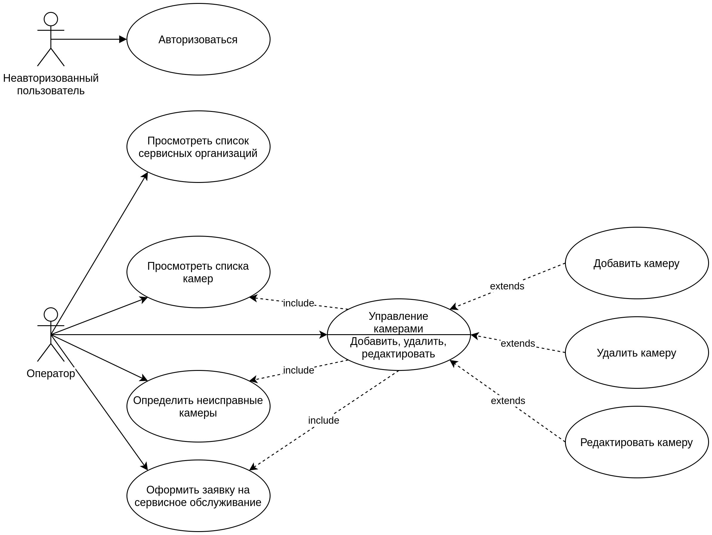
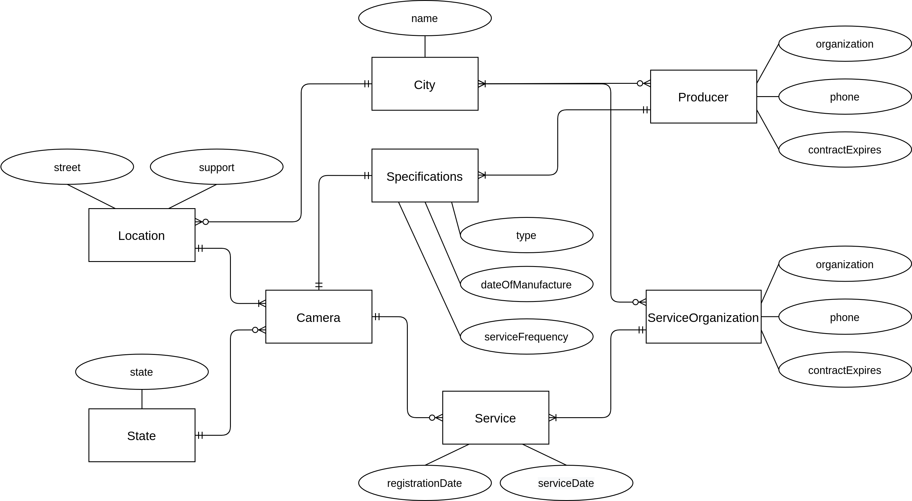

# Лабораторная работа №1
### HTTP, REST, Nginx

1. Взять за основу приложение с базой данных.
2. В md файле кратко описать:
    * цель работы, решаемая проблема;
    * перечень функциональных возможностей;
    * use-case диаграмма системы;
    * ER-диаграмма системы.
3. Спроектировать в формате swagger API системы в идеологии REST.
4. По спроектированному swagger подготовить реализацию в программном коде.
5. Настроить Nginx для работы web-приложения в части маршрутизации.
6. Настроить Nginx в части балансировки.
7. Настроить Nginx таким образом, чтобы подменялось имя сервера в заголовках http-ответов.
8. Настроить кеширование и gzip-сжатие в Nginx.

---

#### Цель работы

Разработать приложение обеспечивающее частичную автоматизацию процессов мониторинга и технического обслуживания камер безопасности дорожного движения.

#### Перечень функциональных возможностей

1. Регистрация и авторизация
2. Просмотр списка камер
3. Добавление, редактирование и удаление камер
4. Просмотр подробной информации о камере
5. Просмотр списка неисправных камер
6. Просмотр списка сервисных организаций
7. Добавление, редактирование и удаление севисных организаций
8. Управление базой данных через административную панель

#### Use-case диаграмма



#### ER диаграмма



#### Результаты нагрузочного тестирования

##### Тестирование без балансировки

```
$ ab -n 100000 -c 100 http://localhost/api/camera
This is ApacheBench, Version 2.3 <$Revision: 1879490 $>
Copyright 1996 Adam Twiss, Zeus Technology Ltd, http://www.zeustech.net/
Licensed to The Apache Software Foundation, http://www.apache.org/

Benchmarking localhost (be patient)
Completed 10000 requests
Completed 20000 requests
Completed 30000 requests
Completed 40000 requests
Completed 50000 requests
Completed 60000 requests
Completed 70000 requests
Completed 80000 requests
Completed 90000 requests
Completed 100000 requests
Finished 100000 requests


Server Software:        TrafficCameraMonitoringSystem
Server Hostname:        localhost
Server Port:            80

Document Path:          /api/camera
Document Length:        146 bytes

Concurrency Level:      100
Time taken for tests:   5.662 seconds
Complete requests:      100000
Failed requests:        0
Non-2xx responses:      100000
Total transferred:      31300000 bytes
HTML transferred:       14600000 bytes
Requests per second:    17661.91 [#/sec] (mean)
Time per request:       5.662 [ms] (mean)
Time per request:       0.057 [ms] (mean, across all concurrent requests)
Transfer rate:          5398.61 [Kbytes/sec] received

Connection Times (ms)
              min  mean[+/-sd] median   max
Connect:        0    2   0.5      2       6
Processing:     1    3   0.7      3      17
Waiting:        0    2   0.7      2      16
Total:          3    6   0.8      6      20

Percentage of the requests served within a certain time (ms)
  50%      6
  66%      6
  75%      6
  80%      6
  90%      7
  95%      7
  98%      7
  99%      8
 100%     20 (longest request)
```

##### Тестирование с балансировкой

```
$ ab -n 100000 -c 100 http://localhost/api/camera
This is ApacheBench, Version 2.3 <$Revision: 1879490 $>
Copyright 1996 Adam Twiss, Zeus Technology Ltd, http://www.zeustech.net/
Licensed to The Apache Software Foundation, http://www.apache.org/

Benchmarking localhost (be patient)
Completed 10000 requests
Completed 20000 requests
Completed 30000 requests
Completed 40000 requests
Completed 50000 requests
Completed 60000 requests
Completed 70000 requests
Completed 80000 requests
Completed 90000 requests
Completed 100000 requests
Finished 100000 requests


Server Software:        TrafficCameraMonitoringSystem
Server Hostname:        localhost
Server Port:            80

Document Path:          /api/camera
Document Length:        146 bytes

Concurrency Level:      100
Time taken for tests:   5.607 seconds
Complete requests:      100000
Failed requests:        0
Non-2xx responses:      100000
Total transferred:      31300000 bytes
HTML transferred:       14600000 bytes
Requests per second:    17833.86 [#/sec] (mean)
Time per request:       5.607 [ms] (mean)
Time per request:       0.056 [ms] (mean, across all concurrent requests)
Transfer rate:          5451.17 [Kbytes/sec] received

Connection Times (ms)
              min  mean[+/-sd] median   max
Connect:        0    2   0.5      2      15
Processing:     0    3   0.9      3      15
Waiting:        0    2   0.8      2      14
Total:          0    6   1.0      6      18

Percentage of the requests served within a certain time (ms)
  50%      6
  66%      6
  75%      6
  80%      6
  90%      7
  95%      7
  98%      7
  99%      8
 100%     18 (longest request)
```
